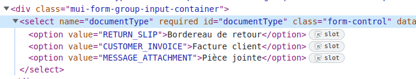

# Intégration d'un nouveau canal

## .env

Ajouter les informations nécessaires (url api, token, shop_id, login...) dans le fichier .env à la racine du projet et les champs vides dans le fichier .env.example.

!!! note 
    Pour les canaux **Mirakl**, veuillez respecter le format de déclaration des variables comme suit :

    ```
    LAPOSTE_API_URL=
    LAPOSTE_API_KEY=
    LAPOSTE_API_SHOP_ID=
    ```
## Import des messages 

Ajouter le canal dans **\App\Enums\Channel\ChannelEnum** (éventuellement aussi dans **\App\Enums\Channel\MiraklChannelEnum** s'il s'agit d'une MP Mirakl).

Créer le fichier de commande d'import des messages dans **App\Console\Commands\ImportMessages**, la class héritera de **AbstractImportMessages**.

!!! note
    - S'il s'agit d'un marketplace **Mirakl**, la class héritera de **AbstractMiraklImportMessages**.
    - Si l'import des messages se fait par le biais d'une boîte **mail** (exemple : ManoMano), la class héritera de **AbstractImportMailMessages**.

Mapper la MP ( si besoin ) dans **\App\Console\Commands\Ticket\Revival::sendRevivalMessage()**.

## Envoi des messages

Créer le job d'envoi de messages dans **App\Jobs\SendMessage**, cette class héritera de AbstractSendMessage.

!!! note 
    - S'il s'agit d'un marketplace **Mirakl**, la class héritera de AbstractMiraklSendMessage.
    - S'il s'agit d'un envoi de message par **mail** (exemple : Manomano), il n'est **pas** nécessaire d'en créer. Le job utilisé est **EmailSendMessage**

Mapper le job dans **\App\Jobs\SendMessage\AbstractSendMessage::dispatchMessage()**

## Pièces jointes

Ajouter le type de pièce jointe dans **Cnsi\Attachments\Enum\DocumentTypeEnum**.

!!! note
    Dans le cas d'une MP **Mirakl**, on trouve cette info en se connectant à Mirakl. Dans le détail d'une commande, onglet 'document', 'ajouter', ensuite inspectez la value de la/les option/s du select du type du document à ajouter.

!!! note
    Si la MP ne gère pas l'envoi de pièces jointe, il faut l'exclure dans la vue **resources/views/tickets/ticket.blade.php après la variable $displayAttachments



Ajouter le @case relatif à la MP et les options nécessaires dans **resources/views/tickets/parts/messages_document_types.blade.php**
