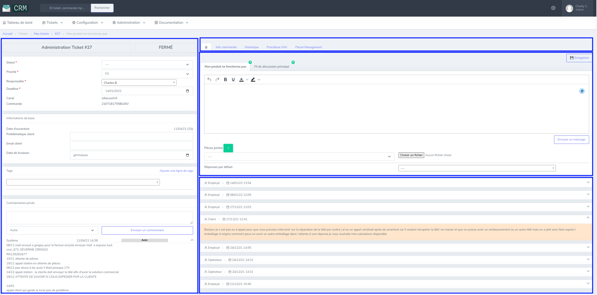
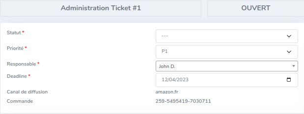
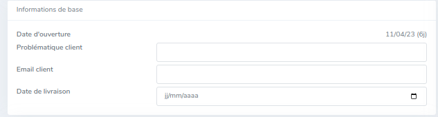

# Qu'est-ce qu'un ticket ?

Dans notre CRM, les tickets sont utilisés pour échanger avec un client à propos de sa commande. La première fois qu'un client nous contacte, un nouveau ticket est créé.
Un ADV peut également créer un ticket s'il a besoin de contacter un client.

- Une commande = Un ticket
- Un ticket = Une commande

Les interlocuteurs possibles sur un ticket sont :

- Le client
- Les ADVs
- Les opérateurs du canal d'achat

!!!note
    Des messages systèmes peuvent aussi être présent. Il s'agit de messages rédigés et envoyés automatiquement par le CRM pour répondre à un client.

## Organisation de l'interface
Un ticket est séparé en plusieurs sections, mises en avant ci-dessous.

- À gauche : les paramètres et informations disponibles sur le ticket
- À droite 
    - Les intégrations d'outils externes (Backoffice, Parcel Management) et l'historique du ticket
    - La zone de réponse au client
    - L'historique des échanges avec le client

## Paramètres d'un ticket

Statut
:   Le client attend-il toujours une réponse (ouvert) ou le ticket a-t-il été résolu (fermé) ?

Priorité
:   P1 pour les nouveaux tickets, P2 pour ceux qui doivent être suivi.

Responsable
:   L'ADV qui est actuellement responsable du ticket.

!!! note 
    Les ticket d'un canal (marketplace) sont attribué à l'ADV responsable de ce canal. Si un ADV ouvre lui-même un ticket, il sera automatiquement attribué au compte connecté.

Deadline
:   Date où le ticket doit être traité.

Canal / Commande
:   Identification de la commande client par son numéro et son canal. Selon le canal, le numéro de commande peut être cliquable, ce lien permet d'accéder au détail de la commande sur le canal d'achat.

## Informations de base

Date d'ouverture
:   La date d'ouverture du ticket sur le CRM. Suivi du nombre de jours depuis lequel il a été créé.

Problématique client
:   Champ libre qui permet de résumer en quelques mots la problématique rencontrée.

Email client
:   Champ libre qui permet d'enregistrer l'email direct du client.

Date de livraison
:   Champ libre qui permet d'enregistrer la date à laquelle le client a été livré.

## Fils de discussion
Un ticket est séparé en plusieurs fils de discussions. Selon les canaux, ils permettent : 

- De séparer les différents sujets évoqués avec le client
- De contacter le client avec différentes méthodes
- De contacter les opérateurs du canal

Les tickets ont également un fil de discussion "Email" :
Il permet d'envoyer un email au client. Ce fil de discussion n'est disponible que pour les commandes qui existent dans le Backoffice. Il ne permet que l'envoi de messages, pas de réception.

!!!note
    📖 Pour une discussion en profondeur sur les fonctionnalités plus complexes, référez-vous à la section Fonctionnalités de cette documentation. 
