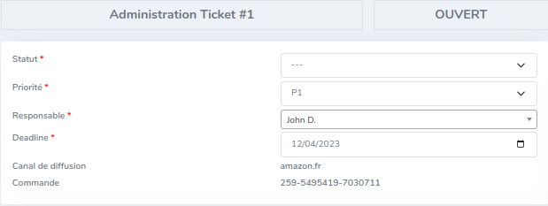
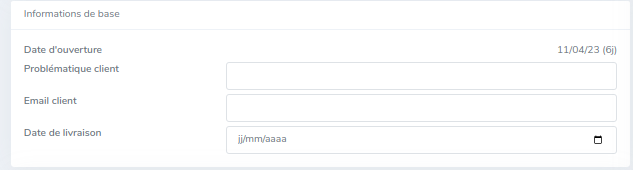
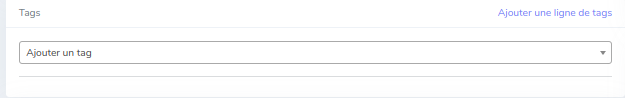
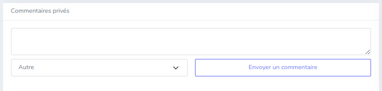
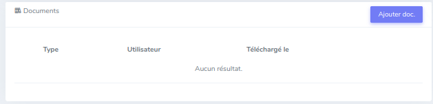
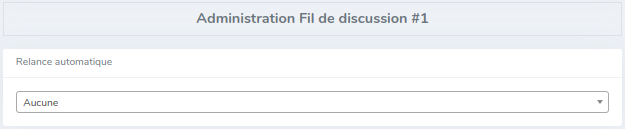
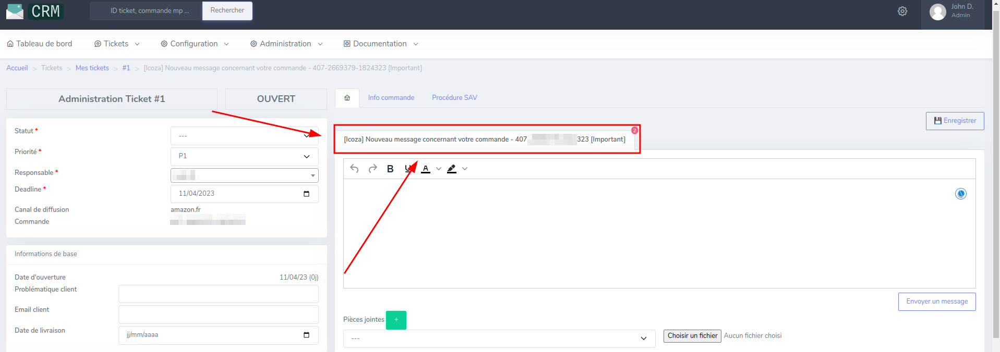

# Qu'est-ce qu'un ticket ?

1 ticket = 1 commande

Un ticket est utilisé pour faire la relation entre un client et le service après-ventes.
Quand un client fait une commande et qu'il a besoin de plus d'information concernant c'elle-ci, le service après-vente aura accès à cette demande via un ticket.

## Liste de ticket 

Pour lister tous les tickets, ils sont affichés de la façon suivante :
![affichage-liste-ticket]

Comme on peut le voir, il y a plusieurs colonnes dans le tableau d'affichage, ce qui peut permettre l'identification plus ciblée d'un ticket.
Nous avons donc dans l'ordre d'affichage,
- ' # ' : Numéro d'identification du ticket.
- Deadline : Date limite de traitement du ticket.
- Responsable : Partie ou sera affiché à qui ce ticket a été affecté.
- Sujets : Titre de la demande ou identification du ticket.
- Statut : État du ticket, ouvert pour dire que la demande client est en cours de traitement, fermé pour dire que la demande a été pris en compte et une solution a été trouvé.
- Priorité : Affiche l'urgence du traitement (détaillé les priorités)
- Canal de diffusion : le nom de la MarketPlace d'où vient cette demande
- Aperçu du tag : affiche les tags assignée au ticket.
- Date d'ouverture : date à laquelle la demande a été faite.

## Vue en détail d'un ticket

Un ticket est séparé en 2 colonnes, la partie avec toutes les informations du ticket (partie gauche) et la partie avec les fils de discussion (partie de droite).

### Information du ticket
Tout d'abord, il y a la partie avec les informations principale d'un ticket avec :
- Le statut du ticket
- La priorité
- Le responsable à qui a été assigné le ticket
- La deadline du ticket
- Le canal de diffusion du ticket
- Le numéro de commande

  Ensuite, nous avons les informations de base :
- La date d'ouverture du ticket, qui dit depuis quand le ticket à commencer à être traité
- La problématique du client
- L'email du client
- Date de livraison

Par la suite, nous avons les tags qui sont details dans la partie fonctionnalités.

À la suite de ça, on a les commentaires privés qui permet aux ADV de mettre des notes sur le ticket pour savoir où en est le ticket, ou encore des informations qui ont été dites lors d'un appel téléphonique.

Puis, nous avons les documents (a détaillé)

Et enfin, nous avons la partie administration avec la relance automatique.

### Fil de discussion

Un fil de discussion est relié à une demande d'un client sur une commande.

Selon le canal de diffusion le systems de fil de discussion est différent.

- Pour les canaux comme Amazon, Fnac et Icoza, il n'y a pas de gestion de file de discussion, on les appelle donc ("Fil de discussion principal")
- Pour les canaux qui sont gérés via Mirakl, les fils de discussion sont directement créés par la MarketPlace
- Pour ManoMano c'est pareil que pour les canaux de type Amazon..., sauf qu'il y a une distinction qui est faite sur l'auteur du message Support / Client:
  - support : Message écrit par la MarketPlace
  - Client : Message écrit par le client

!!! note Fil de discussion créé par défaut = Email. 
    Il permet d'envoyer un email au client.
    L'email est envoyé à l'adresse email définie dans le Backoffice, visible dans la rubrique Info commande.
    Ce fil de discussion n'est disponible que pour les commandes qui existent dans le Backoffice.
    Ne permet que l'envoi de messages, pas de réception.

### Historique des messages
Afin de pouvoir identifier plus rapidement qui est l'auteur d'un message, nous avons un code couleur qui a été mis en place.
Voici donc les différents codes couleur utiliser :

| **Auteur**  | **Couleur** |
|-------------|-------------|
| Client      | Orange      |
| Opérateur   | Rouge       |
| Admin       | Vert        |

### Envoie d'un message

Pour l'envoi de message, il y a un espace pour écrire le message (à terminer)
