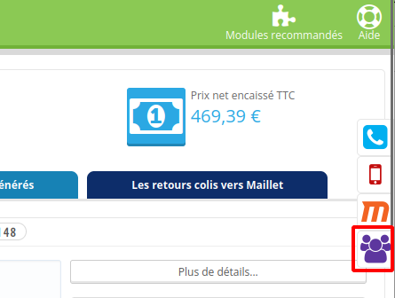
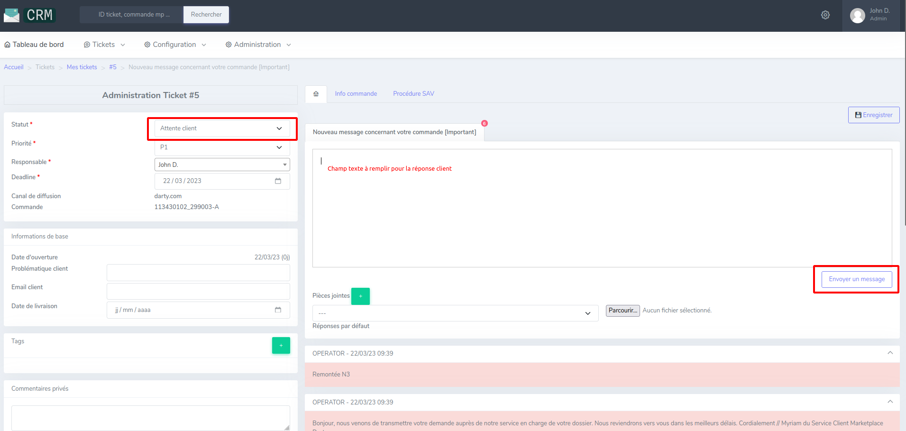
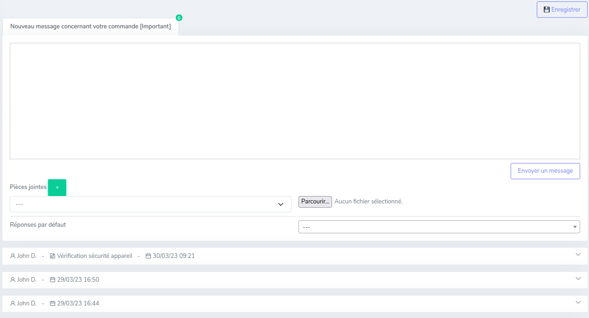
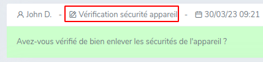
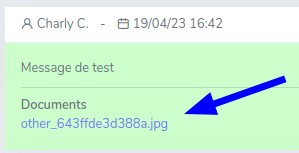

# Travailler sur un ticket

## Créer un ticket

Deux possibilités :

* Les tickets sont créés automatiquement en téléchargeant les demandes via les marketplaces
* Il est aussi possible de créer un ticket manuellement via le backoffice de Prestashop :
    1. Se rendre sur la commande concernée sur Prestashop
    2. Cliquer sur le bouton violet situé à droite :
       
    3. Une nouvelle page s'ouvre affichant l'interface d'un ticket

!!!note
    Ce bouton permet aussi d'accéder à un ticket existant sur une commande.
---

## Répondre à un client

Pour répondre à un client, il faut remplir le champ texte, puis redéfinir le statut du ticket, et enfin cliquer sur le bouton « Envoyer un message ».

!!!warning
    Avant l'envoi du message, le CRM vérifie si le nom d'une autre marketplace que celle affectée du ticket est présent dans le message.
    Si c'est le cas, vous avez possibilité d'annuler ou de confirmer tout de même l'envoi.

### Réponses par défaut

Il est possible de choisir une réponse déjà rédigée à envoyer au client.  
Pour cela, cliquez sur la liste de sélection à droite de « Réponses par défaut » puis choisissez le nom d'une des réponses par défaut.
Le texte apparaitra dans le champ message.

!!!note
    Certaines réponses par défaut ne sont accessibles que sur certaines marketplaces.

Une fois le message envoyé, il est possible d'identifier lorsqu'une réponse par défaut a été envoyée :

### Pièces jointes

Il est possible d'envoyer une ou plusieurs pièces jointes dans la réponse à un client.
Pour cela, il suffit de sélectionner, le cas échéant, le type de pièce jointe, puis de cliquer sur « Parcourir » et enfin de sélectionner le fichier à envoyer.

Pour rajouter un second fichier, il faut cliquer sur le bouton « + » vert et refaire la procédure.

Une fois les pièces jointes ajoutées, il suffit de faire une réponse client et d'envoyer le message.

Les pièces jointes envoyées au client apparaissent dans le message :

---

## Administrer le ticket

### Statut

Il existe actuellement trois statuts différents de ticket :

* Attente Admin : le ticket doit être mis à jour par un opérateur
* Attente Client : le client doit répondre au ticket
* Fermé : le ticket a été résolu

!!!note
    Le statut doit être redéfini à chaque mise à jour du ticket.

### Priorité

Les tickets sont classés par ordre de priorité, P1 étant le plus urgent, P2 étant secondaire.

### Responsable

Le champ responsable permet de définir qui doit traiter le ticket.
Il est possible de changer de responsable en commençant à taper son nom dans le champ,
puis en validant avec la touche Entrée.

### Deadline

Le champ Deadline correspond à la date butoir pour traiter le ticket.
Cette date peut être redéfinie en cliquant sur l'icône calendrier du champ ou
en remplissant la date manuellement.

---

## Préciser le ticket

Il est possible de modifier certaines informations d'un ticket.
Une fois fait, pour enregistrer ces informations, il faut cliquer sur le bouton « Enregistrer » situé
en haut à droite.

### Problématique client

Le champ « Problématique client » permet de renseigner en une phrase,
un résumé du problème rencontré par le client.

### Email client

Le champ « Email client » permet de renseigner la véritable adresse mail du client.
Cela doit être fait à la main, car les marketplaces ne communiquent pas l'adresse mail réelle du client.

### Date de livraison

Le champ « Date de livraison » permet de renseigner la date de livraison du produit concerné par la commande.

