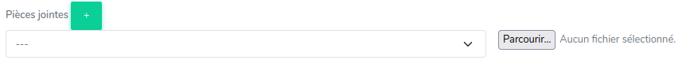

# Travailler sur un ticket

## Créer un ticket
La seule possibilité pour un ADV pour créer un ticket manuellement est de passer par le Backoffice Prestashop :

1. Se rendre sur la commande concernée
2. Cliquer sur le bouton violet situé à droite :
   
3. Une nouvelle page s'ouvre affichant le ticket créé

!!!note
    Ce bouton permet aussi d'accéder à un ticket existant sur une commande.
---

## Répondre à un client
Pour répondre à un client, il faut remplir le champ texte, puis redéfinir le statut du ticket, et enfin cliquer sur le bouton « Envoyer un message ».

!!!warning "Sécurité"
    Avant l'envoi du message, une alerte est levée si le nom d'un autre canal est présent dans le message.
    Vous avez alors la possibilité d'annuler ou de confirmer l'envoi.

### Réponses par défaut
Il est possible d'utiliser un modèle de réponse. Les modèles sont nommés "Réponses par défaut" et sont créés par un responsable.
Pour choisir un modèle, cliquez sur la liste de sélection à droite de « Réponses par défaut », choisissez ensuite le modèle souhaité.
Le modèle est automatiquement ajouté au contenu du message :

!!!note
    Selon la configuration, certaines réponses par défaut ne sont accessibles que sur certains canaux.

Le modèle qui a été utilisé pour rédiger un message est visible dans l'historique :

### Pièces jointes

Il est possible d'envoyer une ou plusieurs pièces jointes au client.
Pour cela, sélectionnez le type de pièce jointe, puis cliquez sur « Parcourir » pour choisir le document à envoyer.

!!!note
    Les types de document disponibles peuvent varier selon le canal.

Pour ajouter un document supplémentaire, il suffit de cliquer sur le bouton « + » en vert et de répéter l'opération.

Les pièces jointes sélectionnées sont envoyées au client lors de l'envoi du message.

Les pièces jointes envoyées au client apparaissent dans l'historique :

!!!note
    Il est possible d'envoyer n'importe quel type de fichier, attention cependant à utiliser des formats lisibles
    par le client : .jpg, .png, .pdf par exemple.
