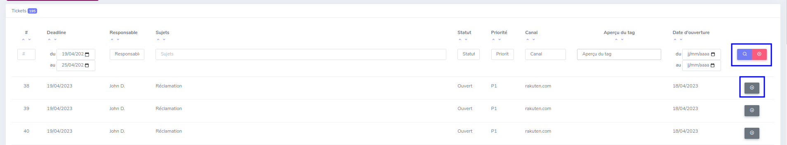
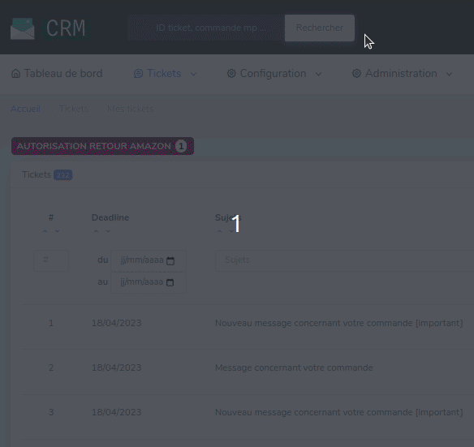

# Retrouver un ticket

!!!warning "Attention"
    🚧 Le contenu de cette page est en cours de rédaction et n'est pas définitif.

## En naviguant dans tous les tickets
Pour retrouver un ticket, il est possible de naviguer dans tous les tickets (menu `Tickets > Tous les tickets`) et d'y appliquer différents filtres. Il est possible de combiner les filtres.

Détail des filtres :

* Numéro du ticket : Ce numéro est unique à chaque ticket
* Deadline : Trouver selon la deadline d'un ticket
* Responsable : Trouver les tickets relatifs à leur responsable
* Sujet : Vous pouvez un mot contenu dans le sujet du ticket à trouver
* Status : Ouvert / Fermé
* Priorité : P1 / P2
* Canal : Tout les tickets d'un canal
* Aperçu du tag : Trouver les tickets contenants un tag particulier
* Date d'ouverture : Trouver selon la date de création du ticket

Pour applique les filtres, il suffit de cliquer sur la loupe à droite de la page ou d'appuyer sur la touche Entrée de votre clavier.
Pour réinitialiser les filtres, il suffit de cliquer sur la croix rouge à côté de la loupe.
Une fois que vous avez trouvé votre ticket dans la liste proposée dans la recherche, vous pouvez aller dans le détail du ticket en cliquant sur la fleche. 

## En naviguant dans mes tickets
En suivant le chemin `Tickets > Mes tickets` vous ne trouverez que les tickets attribués à la personne connectée (C'est comme si le filtre 'Responsable' a été appliqué pour vous). Les filtres disponibles sont les mêmes que pour la recherche de tous les tickets à l'exception près de l'absence du filtre 'Responsable'.

## En recherchant
Il est possible de trouver un ticket de façon précise en utilisant la barre de recherche. Il suffit de taper le numéro du ticket ou de la commande.
Si votre ticket ne se trouver pas dans la recherche, cliquez "voir plus de résultats" pour tenter de le trouver.

## Via le Backoffice Prestashop
Se référer à la [création de ticket](travailler-sur-un-ticket.md#créer-un-ticket).
