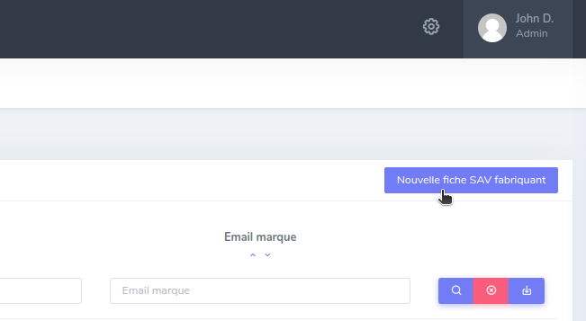

# Fiches SAV fabricants

## Consulter la liste des fiches disponibles

Un onglet est disponible dans le menu "Configuration" de la barre de menu :

## Consulter la liste des fiches SAV fabricant

À partir de la liste, cliquer sur le bouton œil relatif à la fiche :

## Créer une fiche SAV fabricant

Pour créer une fiche, il faut se rendre dans l'onglet Configuration, puis Fiches SAV fabricant.
Cliquer sur le bouton "Nouvelle fiche SAV fabricant" en haut à droite de la page.

## Modifier une fiche SAV fabricant

* La modification est accessible de deux façons :
    1. À partir de la liste, cliquer sur le bouton crayon relatif à la fiche
       
    2. Dans le détail d'une fiche, cliquer sur le bouton "Modifier fiche SAV fabricant"
       

## Supprimer une fiche SAV fabricant

Dans la page de modification d'une fiche, cliquer sur le bouton " Suppression" :

