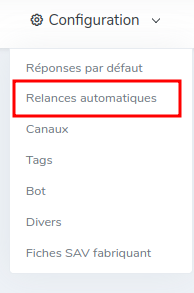
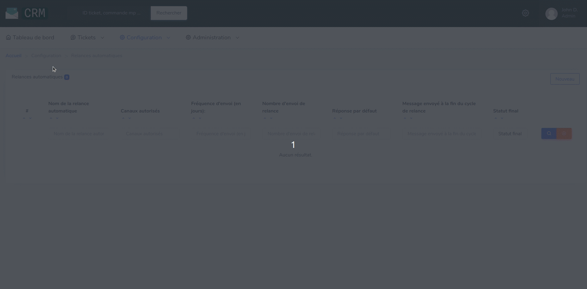

# Configuration des Relances automatiques

Pour configurer les relances automatiques, il faut aller dans la rubrique `Configuration > Relance automatiques`.

La page présente la liste des relances automatiques existantes, avec les possibilités suivantes :

- Ajouter une relance automatique
- Modifier une relance automatique
- Supprimer une relance automatique

Sont détaillés ci-dessous, les différents champs des formulaires de création et modification :

* **Nom de la relance :** Nom qui sera affiché sur un ticket.
* **Fréquence d'envoi :** Permet de choisir le nombre de jours entre 2 envois. Saisissez 1 pour relancer tous les jours.
* **Nombre de relances :** Nombre de messages qui seront envoyés avant que la relance ne se termine.
* **Canaux autorisés :** Liste des canaux pour lesquels la relance sera utilisable. Laissez-vide pour rendre la relance disponible sur tous les canaux.
* **Réponse par défaut :** Choix du message à envoyer (à chaque relance).
* **Message envoyé à la fin du cycle de relance :** Choix du message à envoyer en fin de cycle.
* **Statut final :** Choix du statut de ticket à définir en fin de cycle.
* **Type d'envoi :** Channel pour utiliser la MarketPlace ou SMS pour envoyer un message direct au client.

