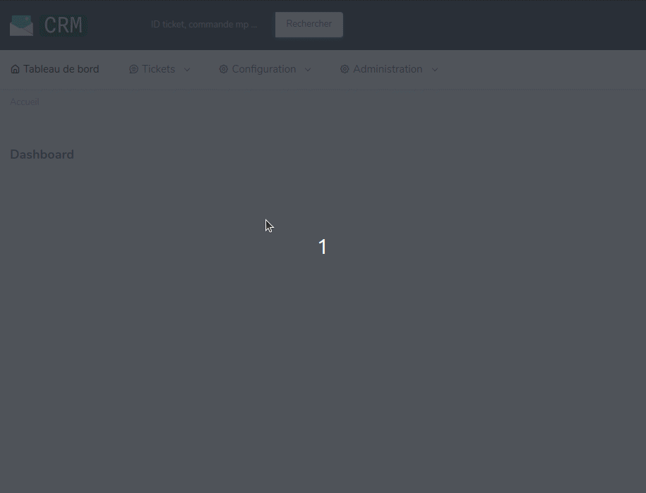
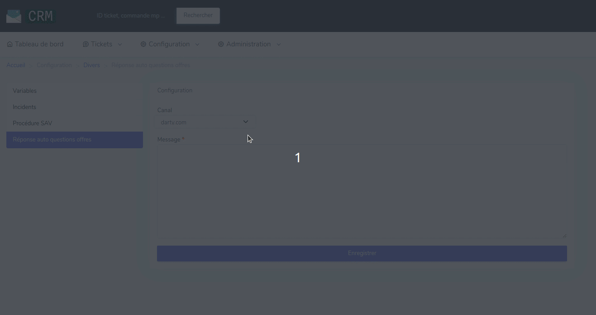

# Template réponse automatique aux questions sur offres

## Consulter les templates réalisés

Pour consulter les templates de réponse automatique qui concernent les questions sur les offres, rendez-vous dans le menu "Configuration", dans l'onglet "Divers".
Puis choisissez "Réponses auto questions offres".
 

## Créer / modifier un template

Choisissez le canal (marketplace) dont vous voulez créer ou modifier le template.
Une fois le canal choisi, si le champ "Message" apparaît vide, c'est qu'il n'existe pas encore de template pour ce canal.
Pour créer un template, il suffit de remplir le champ "Message" avec le texte approprié puis de cliquer sur le bouton "Enregistrer".

