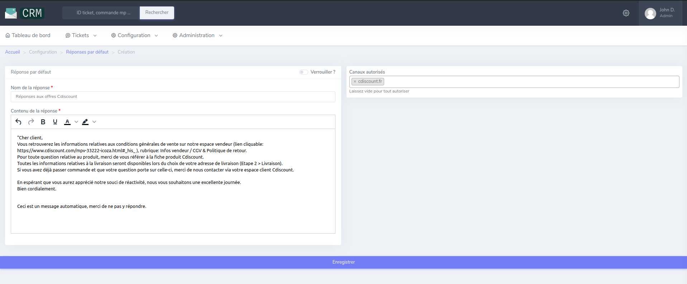

# Réponses par défaut aux questions sur les offres

## Présentation
!!! note
    Cette fonctionnalité n'est accessible actuellement que pour la marketplace Cdiscount.

Lors de l'import automatique des messages de Cdiscount, une vérification est faite sur la nature du message.
Dans le cas d'une question sur une offre sans qu'il n'y eu de commande d'effectuée, nous envoyons une réponse automatique.
Cette réponse doit être rédigée dans l'onglet "Réponses par défaut" du menu "Configuration". 

## Créer une réponse par défaut 
Se rendre dans le menu "Configuration" puis "Réponses par défaut".
Cliquez sur le bouton "Nouveau" à droite de la page.

### Détail des champs :
* Nom de la réponse :
    Le nom de réponse est ce par quoi on va identifier la réponse.
* Contenu de la réponse :
    Le contenu de la réponse est le message que recevra le client.
* Canaux autorisés :
    La réponse par défaut peut être restreinte à un ou plusieurs canaux (marketplaces)
* Verrouiller ? :
    Ce champ n'est accessible que sous condition de droits. Si une réponse par défaut est verrouillée, elle ne sera modifiable que sous condition de droits. 
        
Une fois la réponse rédigée, cliquer sur "Enregister".

## Attribuer la réponse par défaut à l'automatisation souhaitée
La réponse par défaut doit être configurée dans le menu `Configuration > Divers > Réponses par défaut aux questions sur les offres`

