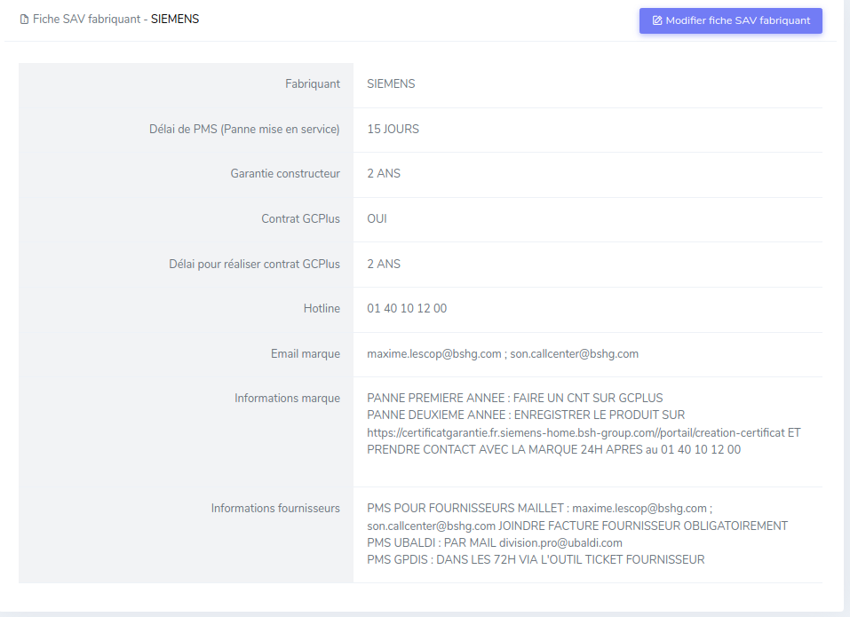

# Fiches SAV fabricants

Une fiche SAV fabricant est un aide-mémoire, spécifique à un fabricant qui décrit ses procédures de SAV.

## Consulter les fiches SAV fabricant
Elles sont accessibles via la barre de recherche, en tapant le nom du fabricant

## Détail d'une fiche

Fabricant
:   Fabricant / Marque pour laquelle on va détailler les conditions ci-dessous

Délai de PMS
:   Délai accepté par une marque pour une panne au déballage

Garantie constructeur
:   Délai de garantie pris en charge par le fabricant
    
    Exemples : 2 ans tout inclues PMOD (pièces main d'oeuvre et déplacement) / 1 an piece et main d'oeuvre sans déplacement

Contrat GCPlus
:   Est-il possible d'établir un contrat de garantie via le site GC+ ?

Délai pour réaliser contrat GCPlus
:   Délai après l'achat pendant lequel on peut encore établir un contrat de garantie

Hotline
:   Numéro de téléphone de la marque

Email marque
:   Email de contact pour demande SAV par internet

Informations marque
:   Spécificités selon les catégories produit

Informations fournisseurs
:   Spécificités selon la source d'achat
