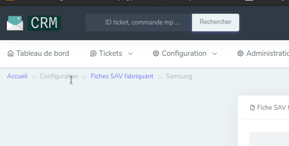

# Fiches SAV fabricants

Les fiches SAV fabricant regroupent les informations nécessaires concernant les procédures SAV des fabricants.

## Consulter les fiches SAV fabricant
Elles sont accessibles via la barre de recherche, en tapant le nom du fabricant
        

## Détail des champs

**Fabricant**: Marque

**Fournisseurs**: Chez qui le produit a été acheté

**Délai de PMS**: Délais accepté par une marque pour une panne au déballage

**Garantie constructeur**: Délais de garantie pris en charge par le fabricant, cela peut varier selon les marques ( 2 ans tout inclues PMOD ( pièces main d'oeuvre et déplacement), 1 an piece et main d'oeuvre sans déplacement )

**Contrat GCPlus**: Possibilité ou non d'établir un contrat de garantie via le site GC+

**Délai pour réaliser contrat GCPlus**

**Hotline**: n° de tel de la marque

**Email marque**: email de contact de la marque pour demande sav par internet

**Informations marque**: spécificité selon les catégories de produit

**Informations fournisseurs**: spécificité selon la source d'achat
