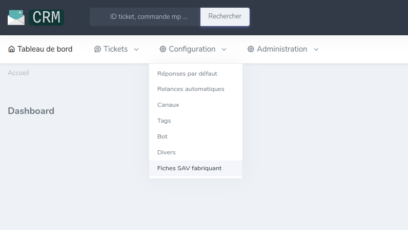
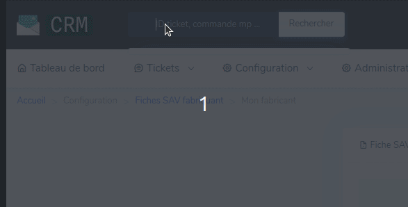
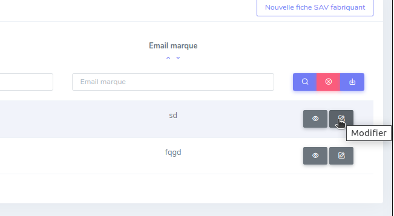
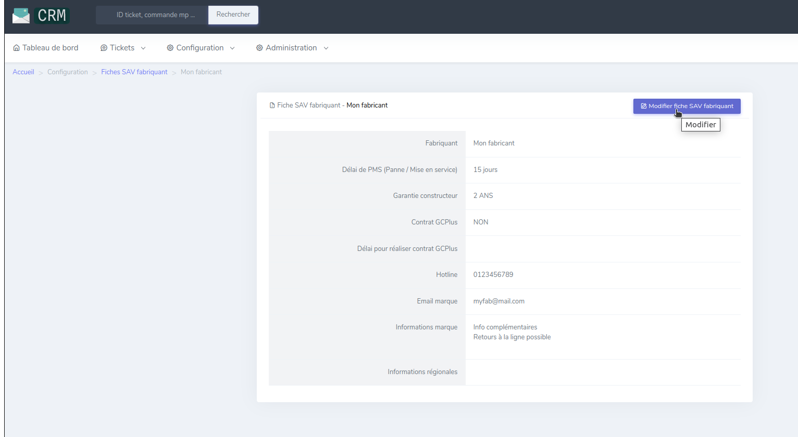
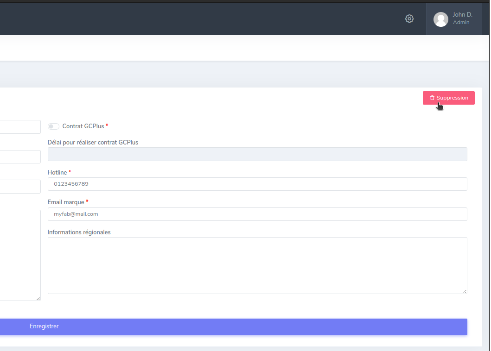

# Fiches SAV fabricants

Les fiches SAV fabricant répertorient les informations nécessaires concernant les procédures SAV des fabricants.
Elles sont à consulter lors 

# Consulter les fiches SAV fabricant

## Consulter la liste des fiches disponibles

Un onglet est disponible dans le menu "Configuration" de la navbar :

## Voir le détail d'une fiche

* Le détail d'une fiche est accessible de deux façons :
    1. À partir de la liste, cliquer sur le bouton œil relatif à la fiche :
        
    2. Via la barre de recherche, en tapant le nom du fabricant
        

    
# Créer une fiche SAV fabricant
!!! note
    Accessible sous condition de rôle

Pour créer une fiche, il faut se rendre dans l'onglet Configuration, puis Fiche Sav fabricant.
Cliquer sur le bouton "Nouvelle fiche SAV fabricant" en haut à droite de la page.

# Modifier une fiche SAV fabricant
!!! note
    Accessible sous condition de rôle

* La modification est accessible de deux façons :
    1. À partir de la liste, cliquer sur le bouton crayon relatif à la fiche :
        
    2. Dans le détail d'une fiche, cliquer sur le bouton "Modifier fiche SAV fabricant" :
        

# Supprimer une fiche SAV fabricant
!!! note
    Accessible sous condition de rôle

Dans la page de modification d'une fiche, cliquer sur le bouton " Suppression" :

