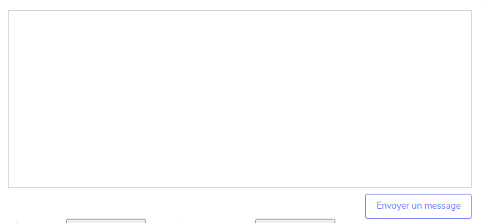

# Variables

Lors de l'écriture d'un message, vous pouvez y insérer des variables.
Une variable est une **information dynamique** qui sera **auto-complétée** dans la réponse envoyée au client.
Cette fonctionnalité à pour but de vous éviter de copier-coller des informations.

!!! note "Exemple"
    La variable `{Prénom client}` sera remplacée par le prénom du client. 

L'utilisation des variables est possible :

* Sur un ticket, dans le champ de réponse à un client
* Dans la conception des réponses par défaut

## Insérer une variable
Pour insérer une variable dans un message, il suffit d'**écrire une accolade** _(Alt GR + 4)_ à l'endroit souhaité. Les variables disponibles s'affichent alors.
Pour sélectionner une variable dans la liste, vous pouvez **cliquer** ou utiliser les **fleches du clavier et la touche Entrée**.

Une fois sélectionnée, le nom de la variable reste affiché tant que le message n'est pas envoyé.
La variable sera converti en texte juste avant que le message soit envoyé au client. 

!!! note
    Après l'enregistrement d'un message, celui-ci n'est pas immédiatement envoyé au client. Il est placé dans une file d'attente d'envoi.
    Cette file d'attente traite les messages dans l'ordre d'arrivée.
    
    En cas d'anomalie, cette file d'attente peut prendre du retard. C'est pourquoi vous pourrez peut-être encore lire le nom de la variable dans l'historique des messages.

## Démonstration

## Liste des variables existantes

Liste des variables par catégories :

### Commande
| nom            | Description                                            | Exemple            |
|----------------|--------------------------------------------------------|--------------------|
| PRENOM_CLIENT  | Prénom du client (adresse de facturation)              |                    |
| NOM_CLIENT     | Nom du client (adresse de facturation)                 |                    |
| URL_SUIVI      | URL de suivi                                           | https://.....      |
| DELAI_COMMANDE | Nombre de jours restant avant la date max d'expédition | 5                  |
| MARKETPLACE    | Nom du canal                                           | Darty.com          |
| NUM_CMD_MP     | Numéro de commande marketplace                         | 114354685_536777-A |

### Admin
| nom             | Description            | Exemple           |
|-----------------|------------------------|-------------------|
| SIGNATURE_ADMIN | Signature de l'employé | Baptiste Turcotte |

### Configuration
Les valeurs des variables ci-dessous sont configurables dans le menu `Configuration > Variables`.

| nom                | Description              | Exemple        |
|--------------------|--------------------------|----------------|
| SIGNATURE_BOT      | Signature du robot       | Olympe         |
| NOM_BOUTIQUE       | Nom de la boutique       | Icoza          |
| TELEPHONE_BOUTIQUE | Téléphone de la boutique | 0 971 00 60 44 |
