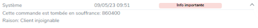
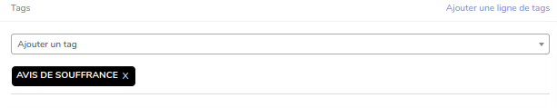

# Avis de souffrance

Un avis de souffrance est une alerte qui est ajoutée à un ticket quand il y a des soucis sur la commande en question

## Fonctionnement

Quand une commande sur le BO rencontre un problème, elle passe à un statut dit "Avis de souffrance".
Ce statut sera donc automatiquement rajouter à la commande dédiée.

Ce processus automatique ajoutera au ticket un commentaire privés avec la raison de la mise en souffrance de la commande


Il ajoutera aussi un tag "avis de souffrance" au ticket.


## Utilisation

Afin d'interagir avec cette route, il faut lui passer en requêtes POST un élément JSON du type suivant:
```JSON
{
    "channel": "",
    "num_command": "",
    "message_souffrance":""
}
```
Les informations entrées dans le script JSON et de type STRING

## Erreurs
### 400
Vous aurez toutes les erreurs provenant d'un type non-respecter dans le JSON

### 401
Vous retrouverez les erreurs liée au token

### 500
Est visible s'il y a une erreur qui sera levée

### 200
S'affiche si tout s'est bien déroulé
