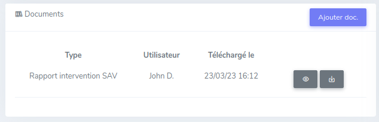
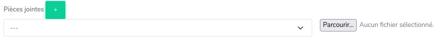
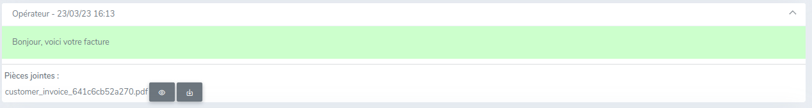

# Documents

Dans le CRM, il est possible d'ajouter des documents, que ce soit pour une utilisation interne ou pour transmettre au client.

## En commentaire privé

Sur un ticket, dans la colonne de gauche, un bloc « Documents » permet l'ajout de fichiers.

Le bouton bleu « Ajout doc. » permet d'en ajouter un en cliquant dessus.

Une liste permet de sélectionner le type de document qui va être envoyé afin de l'identifier par la suite dans la liste.

Si aucun des types ne correspond, il faut choisir « Autre ».

Cliquez ensuite sur l'icône nuage ou glissez le fichier dans la fenêtre pour commencer l'envoi du fichier.

!!!note
    Il est possible d'envoyer n'importe quel type de fichier.

Une fois envoyé, le fichier apparait dans la liste et est consultable par tous les opérateurs pouvant accéder au ticket.

Il est affiché le Type de document, l'utilisateur qui a envoyé le document et à quelle date.

Deux actions sont possibles :

* L'icône œil permet de visualiser le document dans un nouvel onglet, pratique dans le cas d'une image, photo ou document PDF.
* L'icône téléchargement permet de télécharger le fichier

## En réponse à un client

Dans un message client, il est possible d'envoyer un ou plusieurs documents.

Pour ce faire, il faut d'abord choisir le type de document via la liste de sélection,
puis de cliquer sur « Parcourir » pour choisir le fichier à envoyer.

!!!note
    Les types de document affiché dans la liste dépendent de la marketplace associée au ticket.

Pour ajouter un document supplémentaire, il suffit de cliquer sur le bouton « + » en vert et de répéter l'opération.

Une fois les documents ajoutés, il suffit de remplir le champ message et de cliquer sur « Envoyer un message ».

Les documents seront envoyés au client.

Une fois envoyé, le ou les fichiers apparaissent en bas du message transmis au client.

Il est affiché le nom du document et deux actions sont possibles :

* L'icône œil permet de visualiser le document dans un nouvel onglet, pratique dans le cas d'une image, photo ou document PDF.
* L'icône téléchargement permet de télécharger le fichier

!!!note
    Il est possible d'envoyer n'importe quel type de fichier, attention cependant à utiliser des formats lisibles
    par le client : .jpg, .png, .pdf par exemple.

## En réponse automatique

Dans le cas des réponses automatiques, si le bot est activé, des documents peuvent s'envoyer automatiquement au client.

C'est le cas par exemple des factures. Si le mot facture apparait dans un des messages du client, la facture sera récupérée
et envoyée directement au client au format PDF. Aucune action n'est requise de la part de l'opérateur.
