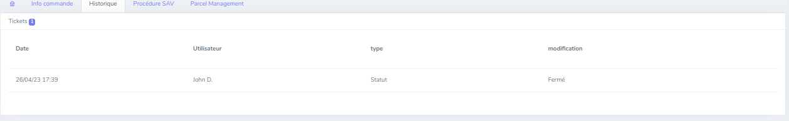
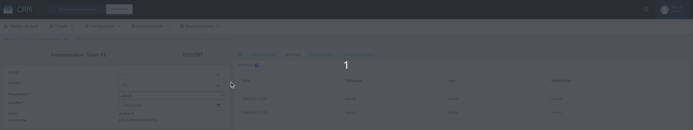

# Historiques

Lors d'une modification sur un ticket, nous pouvons retrouver l'historique des actions réalisé dessus.

## Détails

Comme vous pouvez le voir, il y a plusieurs rubriques :

- la date à laquelle la modification a été réalisée
- l'utilisateur qui a effectué la modification
- le type de modification effectué
- la modification qui affiche la valeur final de la modification

## Comment ça fonctionne ?

Pour pouvoir interagir à cette fonctionnalité, il suffit de modifier une variable sur le ticket et une fois le ticket enregistrer les informations de modification seront directement enregistrer et visible dans l'historique.

Toutes les informations qui se retrouvent dans les historiques font partie des informations de base renseignée au ticket.

