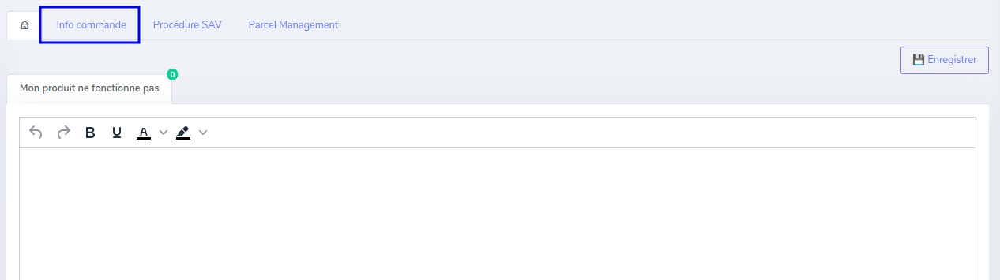
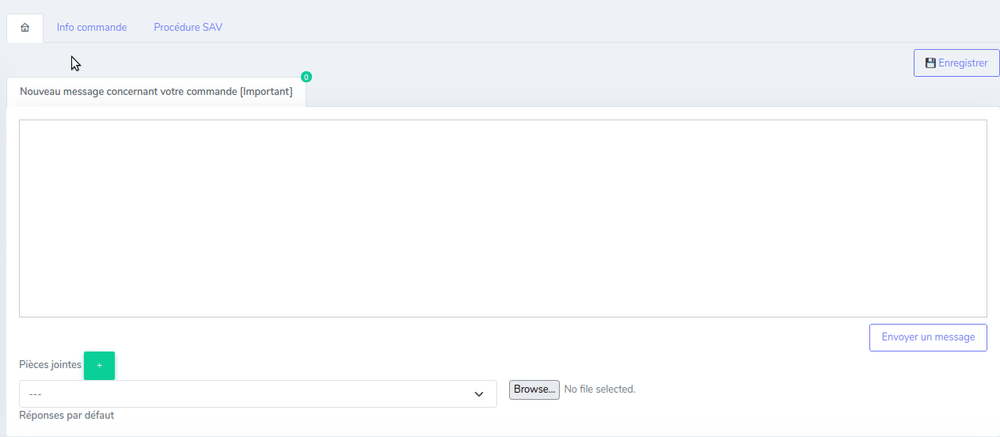
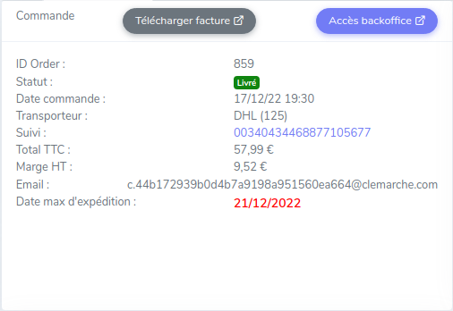
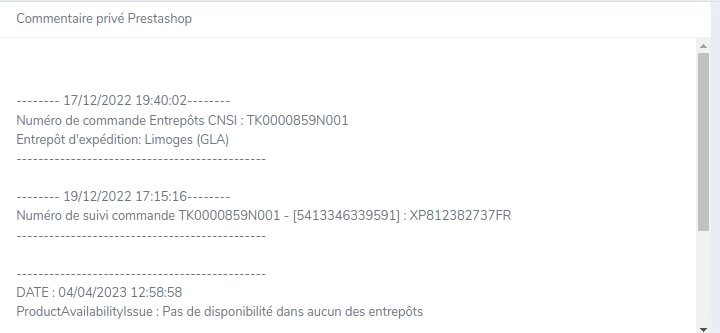
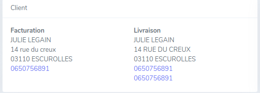
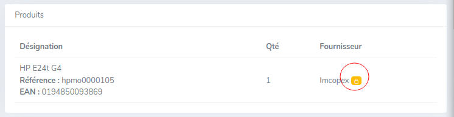

# Info commande

Lors du traitement d'un ticket client, il peut être utile d'afficher les informations relatives à la commande.
Cliquez sur l'onglet « Info commande » pour afficher ces informations.

!!!warning "Information"
    Les informations sont récupérées en direct sur le Backoffice Prestashop, l'affichage des informations peut ainsi prendre quelques secondes.

!!!note
    Si la commande du client a été éclaté en plusieurs commandes dans notre Backoffice Prestashop, il est possible de naviguer entre les différents ID order.
    

Les informations sont divisées en quatre blocs distincts :

## Commande

* ID Order : Identifiant unique de la commande sur le Backoffice Prestashop
* Statut : Statut de la commande (code couleur identique)
* Date commande : Date de la commande
* Transporteur : Le transporteur (transporteur prévisionnel si la commande n'est pas encore expédiée)
* Suivi : Le numéro de suivi de la commande. Il est cliquable si le lien est disponible
* Total TTC : Le total TTC payé par le client
* Marge HT : La marge HT réalisée
* Email : L'email client fourni par le canal (selon le canal il peut être anonymisé)
* Date max d'expédition : Date maximale pour expédier le produit

Des encarts colorés peuvent apparaitre en dessous et donnent d'autres indications :

* Fulfillment : Si la commande est Fulfillment
* SellerFlex : Si la commande est SellerFlex
* Livraison Express : Si le client à fait le choix d'une livraison express (24/48h)
* DEBALLE : Si le client a choisi une livraison avec déballage du produit
* INSTALLE : Si le client a choisi une livraison avec installation du produit
* Incident Ouvert/Fermé : Si un incident a été ouvert par le client

Deux boutons permettent d'effectuer des actions :

* Télécharger facture : Si la facture est disponible, vous pouvez cliquer sur ce bouton pour y accéder
* Accès backoffice : Ce bouton vous redirige sur la commande dans le Backoffice Prestashop

## Commentaire privé Prestashop
Ce bloc affiche le commentaire privé de la commande Prestashop.

## Client
Ce bloc affiche les adresses du client (facturation / livraison). Les numéros de téléphone sont cliquables pour lancer l'appel.

## Produits
Ce bloc affiche le détail des produits et quantités commandés. Le badge jaune indique que le fournisseur est définitif et qu'il ne changera plus.

