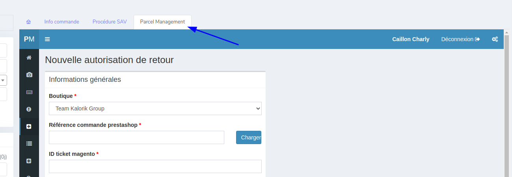
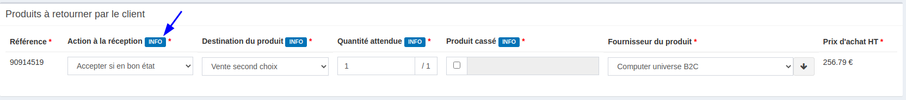

# Parcel Management

Parcel Management est un outil créé et utilisé par CNSI. Il permet de gérer les retours colis à Plessé. Sur le CRM, il est utilisé pour :

- Autoriser un retour (création d'une autorisation de retour)
- Suivre l'avancement d'un retour

L'outil est intégré au CRM via un onglet "Parcel Management" sur chaque ticket :

Le fonctionnement de l'onglet est le suivant : 

- Si une autorisation de retour existe : affichage de celle-ci pour suivi du dossier
- Si l'autorisation n'a pas encore été créée, affichage du formulaire de création

!!!note
    Les champs importants pour créer une autorisation sont directement documentés sur l'interface par des boutons cliquables "INFO".
    
