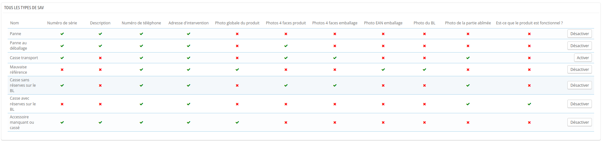
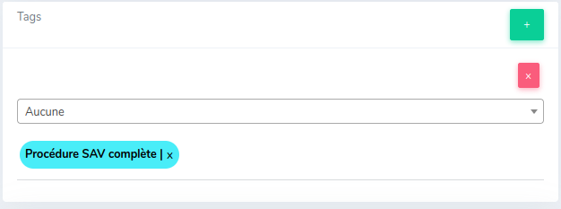
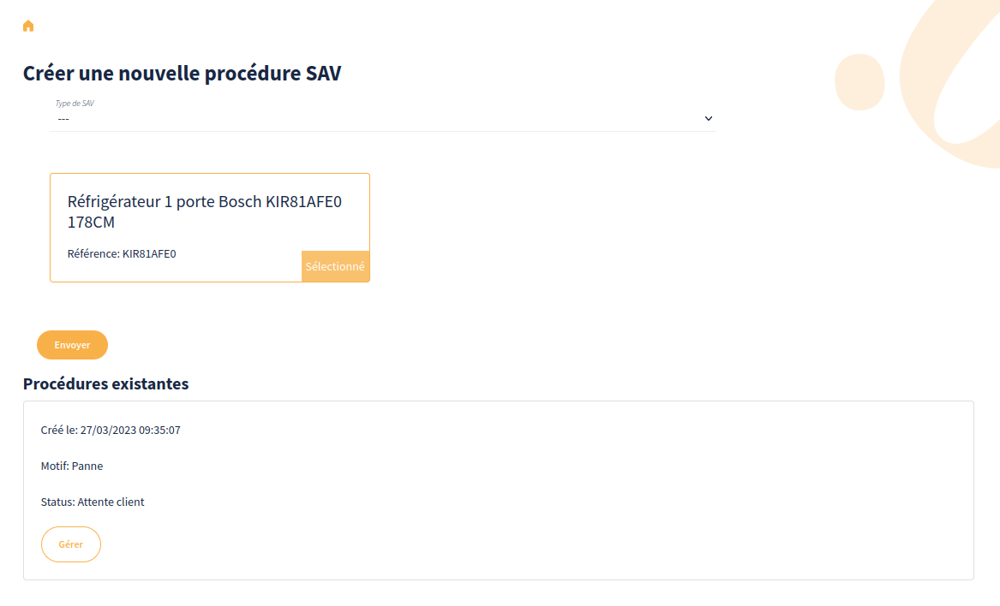
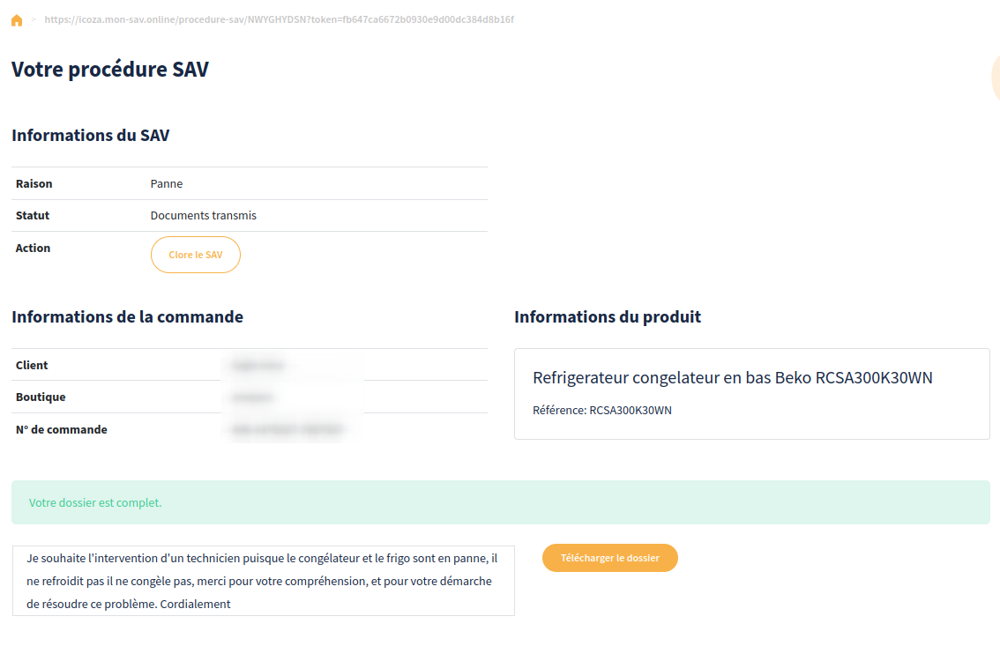

# Procédure SAV

Lorsqu'un client fait une réclamation concernant un produit, il est possible de générer une demande de SAV.

## Créer une demande SAV pour le client

La démarche est la suivante :

1. Aller sur le ticket concerné dans le CRM
2. Cliquer sur l'onglet « Procédure SAV » 
3. Le produit concerné par le ticket apparait dans un encart jaune, dans le cas où la commande concerne plusieurs produits, il est possible de sélectionner le produit concerné 
4. Sélectionner le type de SAV dans la liste « Type de SAV » 
5. Cliquez sur « Envoyer »

Un récapitulatif s'affiche avec un lien à transmettre au client.

!!!note
    Cliquer sur le lien permet de le copier dans le presse-papier.

## Remplissage de la demande SAV par le client

Le client doit ensuite ouvrir ce lien et remplir les champs demandés.
Les champs demandés aux clients sont déterminés par le type de SAV renseigné par l'ADV à la création.

Une fois fait il doit cliquer sur le bouton « Envoyer »

Lorsque c'est bon, un tag « Procédure SAV complète » sera ajouté sur le ticket et il passera en attente admin :

De plus, les relances automatiques suivantes seront supprimées du ticket :

* RELANCE AUTO SAV
* RELANCE AUTO SAV RESOLU
* Relance Casse
* Relance Retour SAV

## Consulter une procédure SAV déjà existante

Si une procédure SAV existe déjà pour le ticket, elle est affichée :

Cliquez sur Gérer pour afficher les détails.

Si le dossier est complet côté client, il est possible de le télécharger en cliquant sur le bouton « Télécharger le dossier » : 

Ce fichier PDF contient un récapitulatif avec les informations du client ainsi que les photos demandées.
