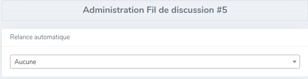
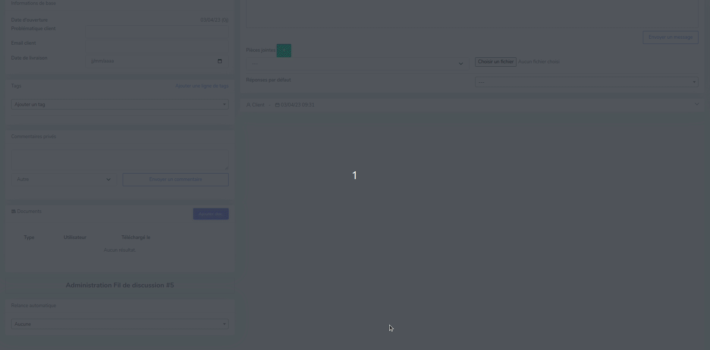

# Relances automatiques

La relance automatique est un système qui permet d'envoyer des messages aux clients sur un intervale précis et une frequence précise.

---

## Configuration sur un ticket

Sur un le ticket, l'emplacement de la configuration ce trouve au niveau de la colone de gauche, dans le rubrique "Administration Fil de discustion #(numéro du fil de discution)".

Il se presente sous cette forme :

Pour l'activer sur le fil de discussion il faut :
* select la relance automatique désirée pour le fil de discussion actuellement ouvert
* changer le statut du ticket en "attente client"
* enregistrer le ticket

Une fois l'ajout fait sur le ticket, on peut remarquer plusieur information sont apparus au niveaux du cadre.

* **Fréquence d'envoie :** determine tous les combien de jours le message sera envoyer.
* **Messages envoyés :** affiche le nombre de message déja envoyer depuis le debut de la configuration de la relance automatique.
* **Prochaine relance :** affiche le jour ou le prochain message sera envoyer.
* **Type d'envoie :** determine comment le message sera envoyer au client.
