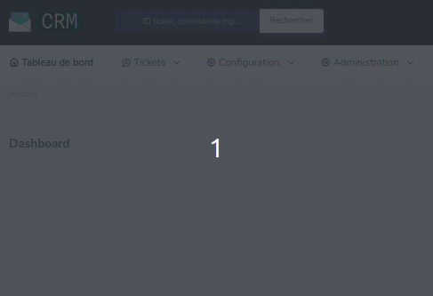
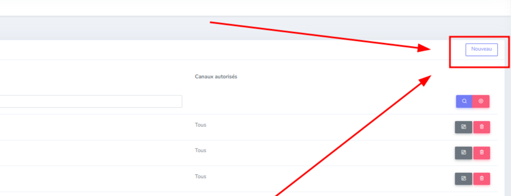
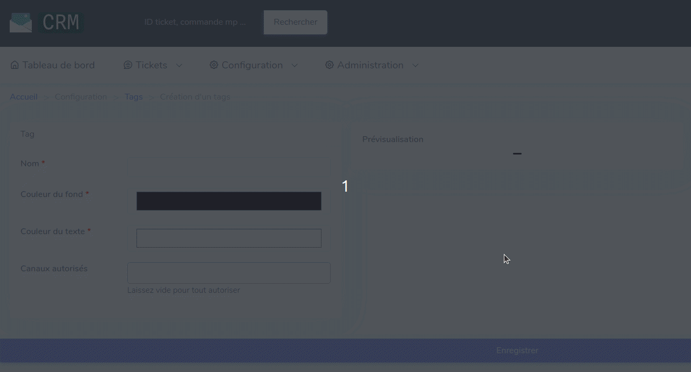

# Tags
---

Lors de l'affichage des tickets, nous avons besoin directement d'identifier le sujet/action à traiter du ticket sans l'ouvrir.
C'est donc là, qu'intervient les tags.

### Affichage

Un tag se présente sous la forme suivante :

* Un nom (permet l'identification du/des sujet(s) du ticket)
* Une couleur (permet l'identification du tag)

---
## Configuration

### Ticket

Sur la page de visualisation des tickets, les tags sont utilisées a plusieurs endroit

//TODO

Pour effectuer l'ajout d'un tag sur un ticket, il faut :

* Rechercher sur le ticket, au niveau de la colonne de gauche l'encadrer qui se nomme : Tags

Il y a plusieurs types d'action réalisable à ce niveau, comme :

* Ajouter un tag sur le ticket
* Supprimer un tag sur le ticket
* Ajouter une nouvelle liste de tags
* Supprimer une nouvelle liste de tags

!!! note
    Une liste de tags permet d'ajouter de nouveaux tags à un ticket (Exemple : le ticket est déjà clos, mais le client a fait une nouvelle action relative à celui-ci) sans supprimer les anciens tags du ticket ou encore surcharger l'ancienne liste déjà présente.

L'ajout d'une liste se fait via le button `Ajouter une ligne de tags`, présent dans l'encadré.

[//]: # (![add_tags_list_on_ticket]&#40;assets/add_tagList.png&#41;)

La suppression d'une liste est automatique, lorsque le dernier tag de la liste est supprimé.

!!! note
    Si vous créez une liste de tags par inadvertance, rechargez la page et elle disparaitra (action possible s'il n'y a pas de tag présent dans cette liste)
---
#### Suppression d'un tag sur un ticket

Pour effectuer la suppression du tag sur un ticket, il faut cliquer sur le bouton situé à droite du tag .

---
## Création du tag

Pour effectuer la création d'un tag vous devez aller dans le menu de configuration, puis dans la rubrique Tags.

Ensuite il faut donc appuyer sur le boutton nouveau, situer en haut à droite.

---

### Configuration d'un nouveau tag

Lors de la configuration d'un nouveau tag il faut renseigner plusieurs information.

* Le nom du tag 
* La couleur du fond
* La couleur du texte
* Les canaux pour lesquels le tag pourra être utilisé

