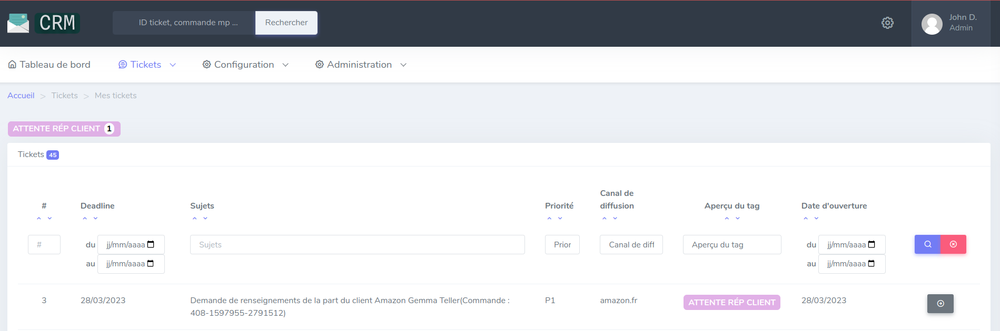
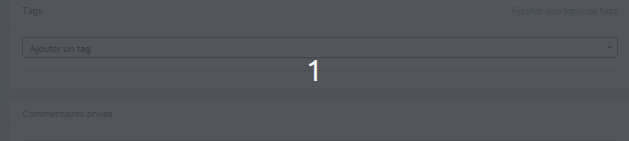
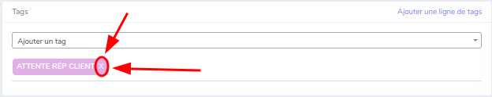

# Tags

Lors de l'affichage des tickets, nous avons besoin directement d'identifier le sujet/action à traiter du ticket sans l'ouvrir.
C'est donc là, qu'intervient les tags.

### Affichage

Un tag se présente sous la forme suivante :

* Un nom (permet l'identification du/des sujet(s) du ticket)
* Une couleur (permet l'identification du tag)

---
## Configuration

### Ticket

Sur la page de visualisation des tickets, les tags sont utilisées a plusieurs endroit

//TODO

Pour effectuer l'ajout d'un tag sur un ticket, il faut :

* Rechercher sur le ticket, au niveau de la colonne de gauche l'encadrer qui se nomme : Tags

Il y a plusieurs types d'action réalisable à ce niveau, comme :

* Ajouter un tag sur le ticket
* Supprimer un tag du ticket
* Ajouter une nouvelle liste de tags
* Supprimer une liste de tags

!!! note
    Une liste de tags permet d'ajouter de nouveaux tags à un ticket.
    
    Exemple : le ticket était fermé mais le client nous recontacte à un autre sujet. Vous pouvez alors créer une nouvelle ligne pour garder les anciens tags et ne pas mélanger les demandes.

L'ajout d'une liste se fait via le button `Ajouter une ligne de tags`, présent dans l'encadré.

[//]: # (![add_tags_list_on_ticket]&#40;assets/add_tagList.png&#41;)

La suppression d'une liste est automatique, lorsque le dernier tag de celle-ci est supprimé.

#### Suppression d'un tag sur un ticket

Pour supprimer un tag du ticket, il faut cliquer sur la croix située à droite de celui-ci.

