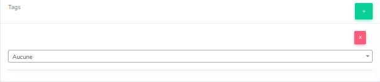
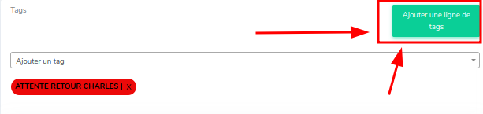

# Tags

Lors de l'affichage des ticket, nous avons besoins de directement identifier le sujet/action à traiter du ticket sans l'ouvrir.
C'est la donc, qu'intervient les tags.

## Affichage

Un tag ce present sous la forme suivante :

* Un nom (permet l'identification du/des sujet(s) du ticket)
* Une couleur (permet l'indetification du tags)

  
## Configuration

### Ticket

Pour effectuer l'ajout d'un tag sur un ticket, il faut:

* Rechercher sur le ticket, au niveau de la colone de gauche l'encadrer qui ce nomme : Tags

il y as plusieurs type d'action réalisable à ce niveau, comme :

* Ajouter un tag sur le ticket
* Supprimer un tag sur le ticket
* Ajouter une nouvelle liste de tags
* Supprimer une nouvelle liste de tags

!!! note
    Une liste de tags permet d'ajouter de nouveaux tags à un ticket (exemple: ticket déjà clos mais le client fait une nouvelle action relative à celui-ci) sans suprimer les anciens tag du ticket ou encore surchargé l'ancienne liste déjà présente.

L'ajout d'une liste se fait via le button 'Ajouter une ligne de tags', présent dans l'encadrer

et pour supprimer une liste, c'est fait automatique lors de la suppression du dernier tag de la liste

!!! note
    Si vous créée une liste de tag par inadvertance, pas de panique, rechargée la page et elle disparaitra (action possible si il n'y pas de tag de mit dans cette liste)
---
#### Supression d'un tag sur un ticket

Pour effectuer la supression du tag sur un ticket, il faut appuyer sur le bouton situer à droite du tag 

### Création du tag

Pour effectuer la création d'un tag vous devez vous diriger au niveau du menu de configuration puis dans la rubrique Tags
