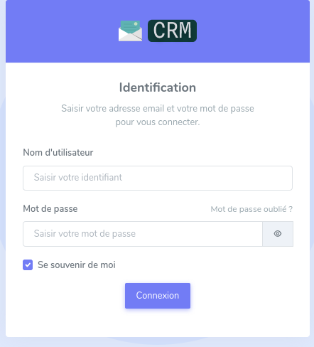
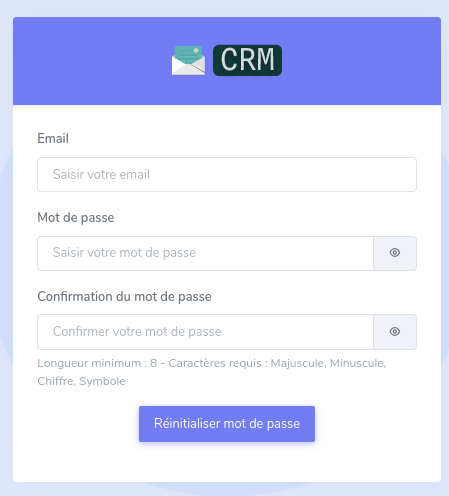

# Mon compte

## Connexion
Saisissez vos identifiants sur la page de connexion pour vous connecter.

{: style="height:400px;"}

!!! note
    La création d'identifiants est réservée à l'équipe développeur. Si votre compte ne vous a pas été transmis, veuillez ouvrir un ticket.

## Mot de passe oublié
En cas d'oubli de mot de passe, utilisez le lien `Mot de passe oublié ?` pour le réinitialiser. Saisissez votre email puis suivez les instructions que vous recevrez sur celui-ci.

Les développeurs ne peuvent pas retrouver un mot de passe.

## Changement de mot de passe
Une fois connecté, la seule option possible sur votre profil est le changement de votre mot de passe. Pour effectuer cette action, rendez-vous dans votre profil, onglet `Mon compte`.

Utiliser ensuite le formulaire `Changer de mot de passe` pour en définir un nouveau.

!!! warning "Sécurité"
    Les règles de sécurité du mot de passes sont décrites directement dans le formulaire. Veuillez les respecter pour que votre nouveau mot de passe soit accepté.

## Déconnexion
Si vous souhaitez vous déconnecter, veuillez cliquer sur votre profil puis Déconnexion.

